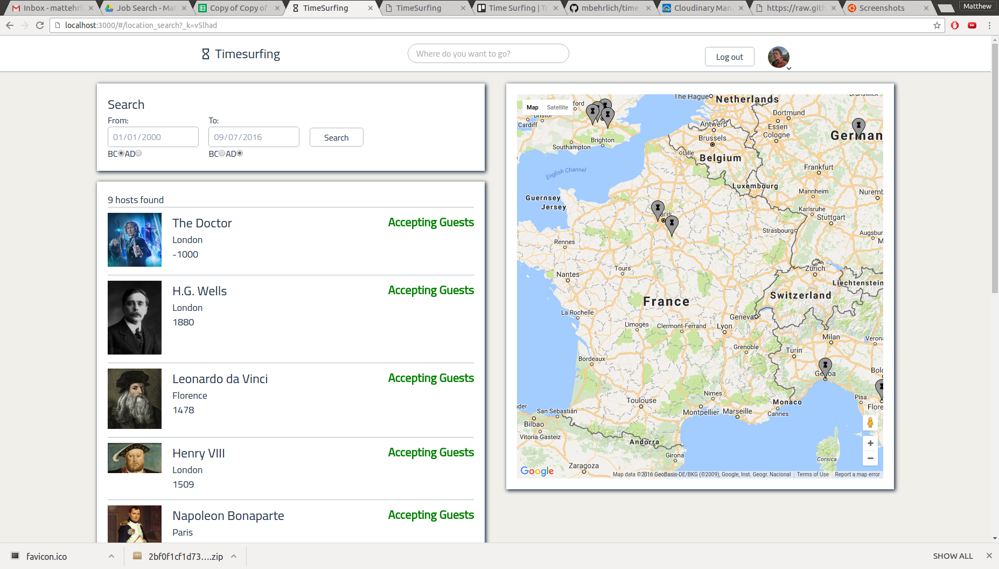

# Timesurfing

[Timesurfing.us](http://www.timesurfing.us)

Timesurfing is a full-stack web app inspired by couchsurfing. The backend is done in Ruby on Rails with a PostgreSQL database.
The frontend is done with React and Redux. I used googleapis for the search and map features.

## Features

### Single-page app

Timesurfing uses react and redux to navigate throughout the site without actually changing the site, for a smoother experience. Timesurfing also uses a responsive design to ensure a good experience on mobile as well.
### User authentication and signup
Users are authenticated using bcrypt. There is a "guest" login so visitors may navigate the site without having to create their own user. Users may edit their profile. Cloudinary is utilized so that users may upload their own profile pictures. Google places api is used so that when users enter their location, the latitude and longitude is extracted to put them on the search map.

"Users" and "Sites" are actually split into two separate models in the database, but the controller combines them into a single jbuilder. This makes the process of finding and editing users and sites easier on the backend. The associated react components also combine users and sites into a single object in the redux store.

### Search locations for users
Google places api and google maps api is used so that users can search for other users to stay with by either typing the location they wish to visit in the search bar, or by scrolling through the map to see different locations. In keeping with the time traveling theme of the website, users can filter by different times to see what users are available at any point in the past or future. The search results are generated using the bounds of the map to determine which users have latitudes and longitudes within the search area.

### Book locations for different times
Users can reserve spots on other users profile pages if they are logged in. The earliest and latest possible dates are autopopulated, and users cannot reserve spots before or after those points, nor can they reserve spots with more guests than the host allows. This is accomplished with rails validation, which is then loaded into an "errors" state on the store. Users can disallow other people from reserving spots from them by changing their settings in the dashboard page.

### Write references for other users
Users can review other users as hosts or guests, and these reviews are listed as either positive or negative.

### Change eras
Although the map has a filter that let's you search specific time periods, a more fun way to navigate my site is to change
the era on the dashboard or splash page. This changes the font, background, google map, and splash page picture for
visitors, as well as sending the reducer an "era", so that only people from that era are loaded on the search page.

### Future features
Features to add include a member search, a friends feature, the ability to send messages to other users, pagination on the location search page, and the ability to add photos other than the profile pic.
